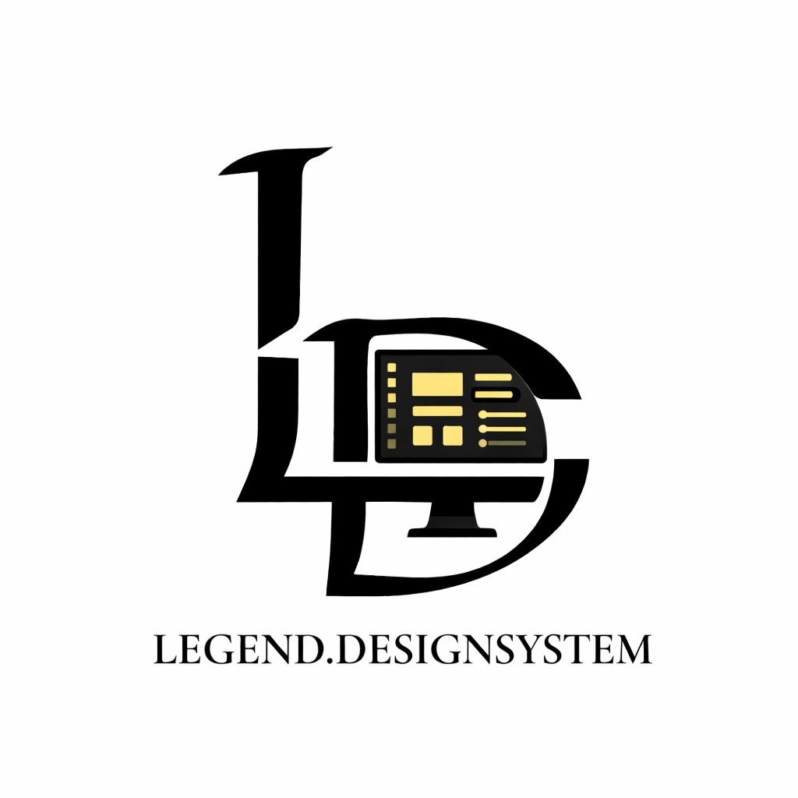
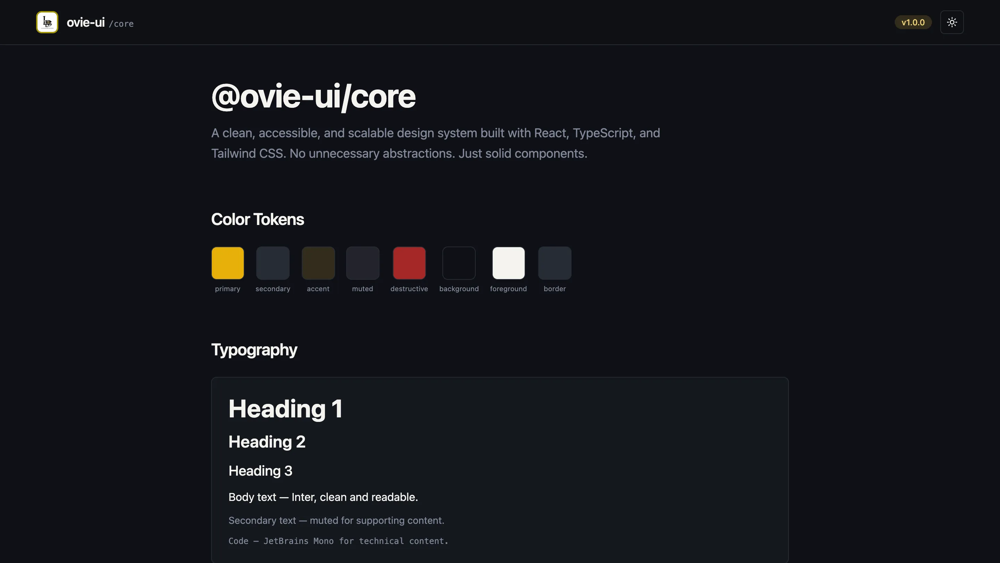

# Ovie Design System

  

Ovie Design System is a scalable, accessible, and production-ready component library built with React, TypeScript, Tailwind CSS, and styled-components. It is designed with a systems-first mindset, focusing on clarity, consistency, and long-term maintainability.

This project reflects the principle that senior engineers build systems, not pages. Every component is designed to be reusable, predictable, and extensible without unnecessary complexity.

---

## Live Demo

Live Link: https://ovie-design-system.vercel.app/

---

## Philosophy

Ovie Design System is built on a few core principles:

- Simplicity over abstraction
- Scalability without over-engineering
- Accessibility by default
- Clean architecture and readable code
- Consistent design tokens
- System-driven thinking

The goal is not to build flashy UI components. The goal is to build a reliable foundation that teams can confidently build on.

---

## Tech Stack

- React
- TypeScript (strict mode)
- Tailwind CSS
- styled-components
- Zustand (state management)
- Lucide React (icons)
- Storybook (documentation)
- Vitest / Jest + React Testing Library (testing)

---

## Design Language

The system uses a soft yellow primary color paired with a deep charcoal tone for contrast and readability. The visual direction prioritizes:

- High contrast without harshness
- Clean spacing scale
- Predictable typography scale
- Neutral grays for structure
- No unnecessary visual noise

Everything is designed to be readable across mobile, tablet, and desktop screens.

---

## Core Components

### Button

A flexible and accessible button component with:

- Variants: primary, secondary, outline, ghost, destructive
- Sizes: small, medium, large
- Loading state support
- Disabled state
- Icon support (left and right)
- Keyboard accessibility
- Proper ARIA attributes

Built for extensibility without bloated props.

---

### Modal

A fully accessible modal system implementing:

- Controlled and uncontrolled patterns
- Compound component architecture
- Focus trap
- Escape key handling
- Click outside detection
- Scroll locking
- ARIA-compliant dialog roles

Structured for clarity and composability.

---

### Dropdown

A custom-built dropdown component without third-party headless libraries.

- Keyboard navigation support
- Controlled and uncontrolled modes
- Accessible menu roles
- Click outside handling
- Clean positioning logic

Designed using the compound component pattern for flexibility.

---

### Tooltip

A lightweight tooltip component with:

- Hover and focus support
- Delay open and close
- Smart positioning
- ARIA-compliant relationships
- Keyboard accessibility

Simple, readable implementation without overcomplication.

---

## Theming System

The theming architecture supports:

- Light mode
- Dark mode
- Persistent theme preference
- Global theme state via Zustand
- Token-driven design configuration

Theme tokens include:

- Colors
- Spacing scale
- Typography scale
- Border radius scale
- Shadow scale

The system is structured to allow easy extension without breaking consistency.

---

## Accessibility

Accessibility is not optional in this system.

Every interactive component:

- Supports keyboard navigation
- Uses proper ARIA roles
- Maintains visible focus states
- Preserves semantic HTML structure
- Meets accessible contrast standards

Accessibility considerations are documented in Storybook.

---

## Architecture

The codebase follows a clean and predictable structure:

- Component-driven organization
- Strict TypeScript typing
- Barrel exports for tree-shaking
- Isolated component folders
- Separation of concerns
- Minimal global state

The architecture prioritizes readability and maintainability over clever abstractions.

---

## Documentation

Storybook is used to:

- Showcase component variants
- Demonstrate usage patterns
- Provide interactive controls
- Preview dark and light themes
- Document accessibility considerations

Each component includes:

- Default usage
- Variant examples
- Playground configuration

---

## Testing

The project includes:

- Unit tests
- Interaction tests
- Accessibility-aware tests
- Visual regression support

Tests are written to be readable and practical, focusing on behavior rather than implementation details.

---

## Performance

Performance considerations include:

- Avoiding unnecessary re-renders
- Using React.memo where appropriate
- Proper forwardRef usage
- Tree-shakeable exports
- Lightweight dependency choices

The system is designed to scale without becoming heavy.

---

## Why This Project Matters

Ovie Design System is more than a UI library. It is a demonstration of:

- System-level thinking
- Scalable frontend architecture
- Production-ready component design
- Accessibility-first development
- Modern React best practices

This project represents a shift from building isolated components to building cohesive systems.

---

## License

This project is open for learning, exploration, and professional showcase.

---

## Author

Built by Ovie Emonefe  
Frontend Engineer focused on scalable systems and clean architecture
